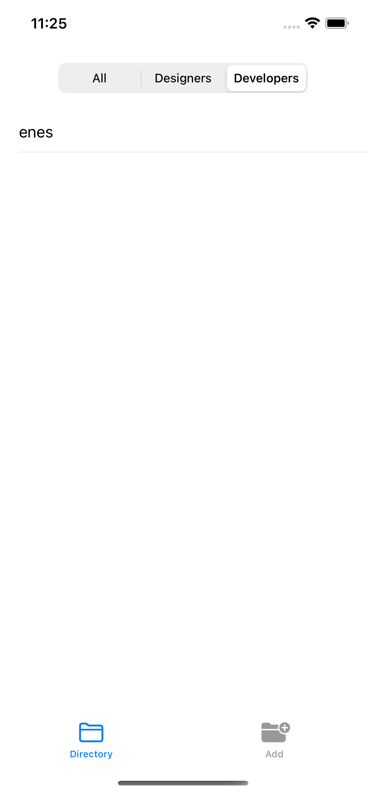
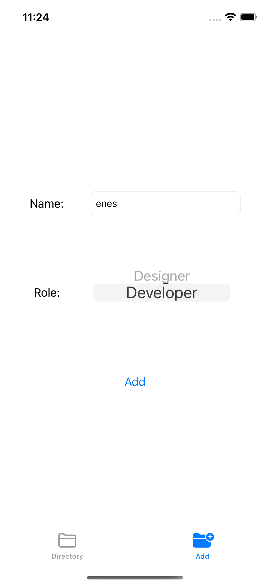

# CrudOperation

## Overview

Read write operations with realm database.

## Features

### Installation

must implement  *realm(must add realmswift)* library using swift package manager.

## Screenshots

## Todo

> **_Todo:_** [ ] Coredata and Sqlite will be added.